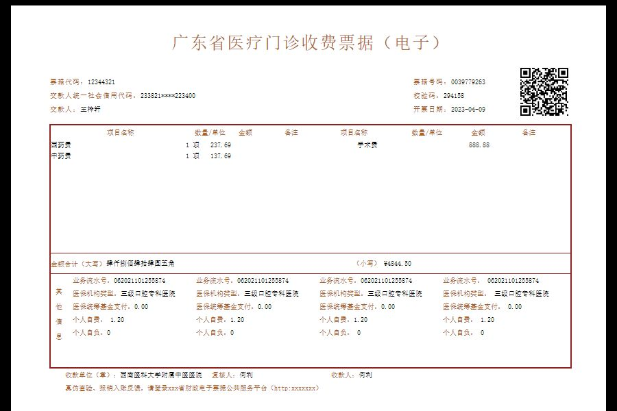

## 简介
- 基于 https://leexhuan.github.io/Invoice/ 进行修改

## 用途
- 生成医疗发票目标,用于生成多模态模型的医疗电子发票训练数据（数据增强）

## 代码
- 印章生成代码: script/step0_generate_seal.py
  - 用于生成医疗电子发票的省份、医院印章, 如下图所示
  
   

   

- 修改模板代码：script/step1_generate_new_html.py

- html转图片代码: script/step2_format_trans.py

   

## TODO
- 把上述三个步骤代码进行串联
- 熟悉html,css代码,优化html template参数传递方式
